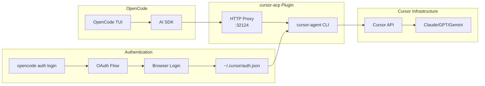

# OpenCode Cursor Plugin

Use your Cursor Pro subscription with [OpenCode](https://github.com/anomalyco/opencode) - the open-source AI coding assistant. Access Claude, GPT-5, Gemini, and 30+ models through Cursor's infrastructure with full streaming, OAuth authentication, and automatic model selection.

## Why This Plugin?

- **Use Cursor Pro in OpenCode** - Leverage your existing Cursor subscription in the terminal
- **30+ Models** - Access Claude 4.5, GPT-5.2, Gemini 3 Pro, and more through one interface
- **OAuth Integration** - Authenticate via browser, no API keys to manage
- **No Rate Limits** - Uses your Cursor Pro quota, not separate API billing
- **HTTP Proxy** - Avoids CLI argument length limits (E2BIG errors)

## Architecture



## Alternatives Comparison

| Feature | cursor-acp (this) | cursor-agent CLI | Cursor IDE | Direct API |
|---------|------------------|------------------|------------|------------|
| OpenCode Integration | ✅ Native plugin | ❌ Manual shell | ❌ Separate app | ✅ With config |
| Authentication | ✅ OAuth via browser | ✅ OAuth via browser | ✅ Built-in | ⚠️ API key required |
| Streaming | ✅ Full support | ✅ Full support | ✅ Built-in | ✅ Provider-dependent |
| Model Selection | ✅ 30+ models | ✅ 30+ models | ✅ UI selector | ⚠️ Per-provider |
| Uses Cursor Quota | ✅ Yes | ✅ Yes | ✅ Yes | ❌ Separate billing |
| Long Prompts | ✅ HTTP proxy | ❌ CLI limits | ✅ No limits | ✅ No limits |
| Cost | Cursor Pro ($20/mo) | Cursor Pro ($20/mo) | Cursor Pro ($20/mo) | Per-token billing |
| Terminal Native | ✅ Yes | ✅ Yes | ❌ GUI only | ✅ Yes |

## Installation

**One-Line Install:**

```bash
curl -fsSL https://raw.githubusercontent.com/Nomadcxx/opencode-cursor/main/install.sh | bash
```

**Quick Install (Go TUI Installer):**

```bash
git clone https://github.com/Nomadcxx/opencode-cursor.git
cd opencode-cursor
./cmd/installer/installer-binary
```

**Manual Install:**

```bash
bun install
bun run build
ln -s $(pwd)/dist/index.js ~/.config/opencode/plugin/cursor-acp.js
```

Then add to `~/.config/opencode/opencode.json`:

```json
{
  "plugin": ["cursor-acp"],
  "provider": {
    "cursor-acp": {
      "name": "Cursor",
      "npm": "@ai-sdk/openai-compatible",
      "options": { "baseURL": "http://127.0.0.1:32124/v1" },
      "models": {
        "auto": { "name": "Cursor Auto" },
        "claude-sonnet-4": { "name": "Claude Sonnet 4" },
        "gpt-4o": { "name": "GPT-4o" }
      }
    }
  }
}
```

## Authentication

Before using cursor-acp, you need to authenticate with Cursor:

```bash
# Run the interactive auth command
opencode auth login

# In the provider selector:
# 1. Type "other" to search
# 2. Select "Other" from the list
# 3. Enter "cursor-acp" as the provider ID
# 4. A Cursor login URL will be displayed - open it in your browser
# 5. Complete authentication in browser
```

**Note:** Do NOT run `opencode auth login cursor-acp` - OpenCode interprets arguments as URLs, not provider IDs.

Alternatively, authenticate directly with cursor-agent:
```bash
cursor-agent login
```

## Usage

```bash
# Run with auto model
opencode run "your prompt" --model cursor-acp/auto

# Or select specific model
opencode run "your prompt" --model cursor-acp/sonnet-4.5
```

## Configuration

### Environment Variables

| Variable | Default | Description |
|----------|---------|-------------|
| `CURSOR_ACP_LOG_LEVEL` | `info` | Log verbosity: `debug`, `info`, `warn`, `error` |
| `CURSOR_ACP_LOG_SILENT` | `false` | Set to `1` to disable all logging |

### Auth Status

Check your authentication status:
```bash
# Via exported function
node -e "const { formatStatusOutput } = require('opencode-cursor'); console.log(formatStatusOutput())"
```

## Prerequisites

- [Bun](https://bun.sh/) - JavaScript runtime
- [cursor-agent](https://cursor.com/) - Cursor CLI (`curl -fsSL https://cursor.com/install | bash`)

## How It Works

See the [Architecture diagram](#architecture) above. In brief:

1. **Plugin loads** → Starts HTTP proxy on port 32124
2. **OpenCode request** → AI SDK sends to proxy as OpenAI-compatible API
3. **Proxy translates** → Spawns `cursor-agent` with prompt
4. **cursor-agent** → Authenticates via `~/.cursor/auth.json`, calls Cursor API
5. **Response streams** → Back through proxy to OpenCode

## Models

Available models include:
- `cursor-acp/auto` - Auto-select best available
- `cursor-acp/sonnet-4.5` - Claude 4.5 Sonnet
- `cursor-acp/opus-4.5` - Claude 4.5 Opus
- `cursor-acp/gpt-5.2` - GPT-5.2
- `cursor-acp/gemini-3-pro` - Gemini 3 Pro
- ... and 25+ more

## Features

- **OAuth Authentication** - Browser-based login, no API keys
- **HTTP Proxy Mode** - Bypasses CLI argument length limits (E2BIG)
- **Full Streaming** - Real-time response streaming
- **30+ Models** - Claude, GPT, Gemini, DeepSeek, and more
- **Auto Model Selection** - Use `cursor-acp/auto` for best available
- **Structured Logging** - Configurable log levels for debugging
- **Error Handling** - Parses quota/auth/network errors with helpful messages
- **Go TUI Installer** - Interactive setup with progress tracking

## Troubleshooting

**"fetch() URL is invalid" on auth login:**
- Run `opencode auth login` without arguments, then select "Other" → "cursor-acp"

**Model not responding:**
- Check authentication: `cursor-agent login`
- Verify proxy: `curl http://127.0.0.1:32124/health`

**Quota exceeded:**
- Check usage at [cursor.com/settings](https://cursor.com/settings)

## License

BSD-3-Clause
