<p align="center">
  
  
</p>

No prompt limits. No broken streams. Full thinking + tool support in Opencode. Your Cursor subscription, properly integrated.

## Installation

**Option A: One-Line Install**

```bash
curl -fsSL https://raw.githubusercontent.com/Nomadcxx/opencode-cursor/main/install.sh | bash
```

**Option B: npm Package (Recommended for updates)**

```bash
npm install -g open-cursor
open-cursor install
```

Upgrade later with:

```bash
npm update -g open-cursor
open-cursor sync-models
```

**Option C: TUI Installer**

```bash
git clone https://github.com/Nomadcxx/opencode-cursor.git
cd opencode-cursor
go build -o ./installer ./cmd/installer && ./installer
```

**Option D: Let an LLM do it**

Paste this into any LLM agent (Claude Code, OpenCode, Cursor, etc.):

```
Install the cursor-acp plugin for OpenCode:

1. Clone and build:
   git clone https://github.com/Nomadcxx/opencode-cursor.git
   cd opencode-cursor
   bun install && bun run build

2. Create plugin symlink:
   mkdir -p ~/.config/opencode/plugin
   ln -sf $(pwd)/dist/plugin-entry.js ~/.config/opencode/plugin/cursor-acp.js

3. Get available models:
   cursor-agent models

4. Add to ~/.config/opencode/opencode.json - merge with existing config:
   - Add "cursor-acp" to the "plugin" array
   - Add a "cursor-acp" provider with models from step 3
   - Set npm to "@ai-sdk/openai-compatible"
   - Set options.baseURL to "http://127.0.0.1:32124/v1"

5. Verify: opencode models | grep cursor
```

**Option E: Manual Install**

```bash
bun install && bun run build
ln -s $(pwd)/dist/plugin-entry.js ~/.config/opencode/plugin/cursor-acp.js
```

The installers handle the rest automatically. If you're doing a manual install, you'll need to do the following steps yourself.

Easiest way is to run the sync script, which populates everything for you:

```bash
./scripts/sync-models.sh
```

Or if you'd rather do it by hand, add this to `~/.config/opencode/opencode.json`:

```json
{
  "plugin": ["cursor-acp"],
  "provider": {
    "cursor-acp": {
      "name": "Cursor",
      "npm": "@ai-sdk/openai-compatible",
      "options": { "baseURL": "http://127.0.0.1:32124/v1" },
      "models": {
        "auto": { "name": "Auto" },
        "composer-1": { "name": "Composer 1" },
        "gpt-5.2": { "name": "GPT-5.2" },
        "gpt-5.2-high": { "name": "GPT-5.2 High" },
        "gpt-5.2-codex": { "name": "GPT-5.2 Codex" },
        "gpt-5.2-codex-low": { "name": "GPT-5.2 Codex Low" },
        "gpt-5.2-codex-high": { "name": "GPT-5.2 Codex High" },
        "gpt-5.2-codex-xhigh": { "name": "GPT-5.2 Codex Extra High" },
        "gpt-5.2-codex-fast": { "name": "GPT-5.2 Codex Fast" },
        "gpt-5.2-codex-low-fast": { "name": "GPT-5.2 Codex Low Fast" },
        "gpt-5.2-codex-high-fast": { "name": "GPT-5.2 Codex High Fast" },
        "gpt-5.2-codex-xhigh-fast": { "name": "GPT-5.2 Codex Extra High Fast" },
        "gpt-5.1-high": { "name": "GPT-5.1 High" },
        "gpt-5.1-codex-max": { "name": "GPT-5.1 Codex Max" },
        "gpt-5.1-codex-max-high": { "name": "GPT-5.1 Codex Max High" },
        "opus-4.6-thinking": { "name": "Claude 4.6 Opus (Thinking)" },
        "opus-4.6": { "name": "Claude 4.6 Opus" },
        "opus-4.5": { "name": "Claude 4.5 Opus" },
        "opus-4.5-thinking": { "name": "Claude 4.5 Opus (Thinking)" },
        "sonnet-4.5": { "name": "Claude 4.5 Sonnet" },
        "sonnet-4.5-thinking": { "name": "Claude 4.5 Sonnet (Thinking)" },
        "gemini-3-pro": { "name": "Gemini 3 Pro" },
        "gemini-3-flash": { "name": "Gemini 3 Flash" },
        "grok": { "name": "Grok" }
      }
    }
  }
}
```

## Authentication

### Option 1: Via OpenCode (Recommended)

```bash
opencode auth login
```

Then follow the prompts:

1. Select **"Other"** from the provider list
2. Enter provider id: **cursor-acp**
3. Browser will open automatically - click "Continue with Cursor"
4. Return to terminal when you see "Login successful"

### Option 2: Direct (CLI only)

```bash
cursor-agent login
```

Then open the URL shown in your browser and complete authentication.

Credential file locations:

- macOS: `~/.cursor/cli-config.json` (current) or `~/.cursor/auth.json` (legacy)
- Linux: `~/.config/cursor/cli-config.json` or `~/.config/cursor/auth.json` (or `$XDG_CONFIG_HOME/cursor/`)

## Usage

```bash
opencode run "your prompt" --model cursor-acp/auto
opencode run "your prompt" --model cursor-acp/sonnet-4.5
```

If installed via npm, manage setup with:

```bash
open-cursor status
open-cursor sync-models
```

## Models

Models are pulled from `cursor-agent models` and written to your config during installation. If Cursor adds new models later, re-run:

```bash
./scripts/sync-models.sh
```

The proxy also exposes a `/v1/models` endpoint that fetches models in real-time:

```bash
curl http://127.0.0.1:32124/v1/models
```

Common models: `auto`, `sonnet-4.5`, `opus-4.6-thinking`, `opus-4.6`, `gpt-5.2`, `gemini-3-pro`, `grok`, `composer-1`

## Architecture

```mermaid
flowchart TB
    subgraph SETUP["📦 Setup (one-time)"]
        direction TB
        INSTALL["install.sh / TUI installer"]
        BUILD["bun install && bun run build"]
        SYNC["sync-models.sh\ncursor-agent models → parse"]
        INSTALL --> BUILD --> SYNC
    end

    subgraph AUTH_FLOW["🔑 Auth (one-time)"]
        direction TB
        LOGIN["opencode auth login\nor cursor-agent login"]
        BROWSER["Browser OAuth\ncursor.com"]
        LOGIN -->|"open URL"| BROWSER
        BROWSER -->|"token saved"| CREDS
    end

    subgraph CONFIG["⚙️ Config & Credentials"]
        direction LR
        SYMLINK["~/.config/opencode/plugin/cursor-acp.js\n→ dist/plugin-entry.js"]
        CONF["~/.config/opencode/opencode.json\nprovider · models · baseURL"]
        CREDS["~/.cursor/auth.json\nor ~/.config/cursor/cli-config.json"]
    end

    subgraph RUNTIME["▶ Runtime (every request)"]
        direction TB
        OC["OpenCode"]
        SDK["@ai-sdk/openai-compatible"]
        PROXY["cursor-acp HTTP proxy\n:32124"]
        CA["cursor-agent\nstdin→prompt · stdout→response"]
        API["Cursor API"]

        OC -->|"select model"| SDK
        SDK -->|"POST /v1/chat/completions"| PROXY
        PROXY -->|"spawn + pipe stdin"| CA
        CA -->|"HTTPS"| API
        API -->|"response"| CA
        CA -->|"stdout"| PROXY
        PROXY -->|"SSE stream"| SDK
        SDK --> OC
    end

    SETUP -.->|"creates"| SYMLINK
    SETUP -.->|"populates"| CONF
    SYMLINK -.->|"loads plugin"| PROXY
    CONF -.->|"configures"| SDK
    CREDS -.->|"reads token"| CA
```



**Setup** runs once during installation. **Auth** creates credentials via browser OAuth. At **runtime**, every request flows through the HTTP proxy which spawns `cursor-agent` per call, piping prompts via stdin to avoid shell argument limits.

## Alternatives

|                   |         cursor-acp          | [yet-another-opencode-cursor-auth](https://github.com/Yukaii/yet-another-opencode-cursor-auth) | [opencode-cursor-auth](https://github.com/POSO-PocketSolutions/opencode-cursor-auth) | [cursor-opencode-auth](https://github.com/R44VC0RP/cursor-opencode-auth) |
| ----------------- | :-------------------------: | :--------------------------------------------------------------------------------------------: | :----------------------------------------------------------------------------------: | :----------------------------------------------------------------------: |
| **Architecture**  | HTTP proxy via cursor-agent |                                       Direct Connect-RPC                                       |                             HTTP proxy via cursor-agent                              |                       Direct Connect-RPC/protobuf                        |
| **Platform**      |        Linux, macOS         |                                          Linux, macOS                                          |                                     Linux, macOS                                     |                          macOS only (Keychain)                           |
| **Max Prompt**    |    Unlimited (HTTP body)    |                                            Unknown                                             |                                   ~128KB (ARG_MAX)                                   |                                 Unknown                                  |
| **Streaming**     |            ✓ SSE            |                                             ✓ SSE                                              |                                     Undocumented                                     |                                    ✓                                     |
| **Error Parsing** |    ✓ (quota/auth/model)     |                                               ✗                                                |                                          ✗                                           |                              Debug logging                               |
| **Installer**     |      ✓ TUI + one-liner      |                                               ✗                                                |                                          ✗                                           |                                    ✗                                     |
| **OAuth Flow**    |   ✓ OpenCode integration    |                                            ✓ Native                                            |                                    Browser login                                     |                                 Keychain                                 |
| **Tool Calling**  | ✓ Native (7 built-in + SDK/MCP) |                                            ✓ Native                                            |                                    ✓ Experimental                                    |                                    ✗                                     |
| **Stability**     | Stable (uses official CLI)  |                                          Experimental                                          |                                        Stable                                        |                               Experimental                               |
| **Dependencies**  |      bun, cursor-agent      |                                              npm                                               |                                  bun, cursor-agent                                   |                               Node.js 18+                                |
| **Port**          |            32124            |                                             18741                                              |                                        32123                                         |                                   4141                                   |

**Key advantages of cursor-acp:**

- Avoids E2BIG errors with large prompts (uses HTTP body, not CLI args)
- Structured error parsing with actionable suggestions
- Cross-platform (not locked to macOS Keychain)
- TUI installer for easy setup
- Native tool calling with 7 built-in tools, SDK and MCP executor support, and a skills/alias system
- Uses official cursor-agent CLI (more stable than reverse-engineering Connect-RPC)

## Prerequisites

- [Bun](https://bun.sh/)
- [cursor-agent](https://cursor.com/) - `curl -fsSL https://cursor.com/install | bash`

**Option A (one-line install):** If Go is installed, the script runs the TUI installer; otherwise it performs a shell-only install (Bun + cursor-agent required). For syncing models without the TUI, install [jq](https://jq.org/) or run `./scripts/sync-models.sh` after install.

**Option B (TUI installer):** Go 1.21+ required to build the installer.

## Features

- HTTP proxy (avoids E2BIG errors)
- Streaming responses with thinking and tool call support
- OAuth authentication
- Error parsing (quota/auth/network)

## Development

Build and run tests locally:

```bash
bun install
bun run build
bun run test:ci:unit
bun run test:ci:integration
```

CI runs split suites in `.github/workflows/ci.yml`:

- `unit` job: `bun run test:ci:unit`
- `integration` job: `bun run test:ci:integration`

Integration CI defaults to OpenCode-owned loop mode:

- `CURSOR_ACP_TOOL_LOOP_MODE=opencode`
- `CURSOR_ACP_PROVIDER_BOUNDARY=v1`
- `CURSOR_ACP_ENABLE_OPENCODE_TOOLS=true`
- `CURSOR_ACP_FORWARD_TOOL_CALLS=false`
- `CURSOR_ACP_EMIT_TOOL_UPDATES=false`

## Troubleshooting

**"fetch() URL is invalid"** - Run `opencode auth login` without arguments

**Model not responding** - Run `cursor-agent login` to re-authenticate

**Quota exceeded** - Check [cursor.com/settings](https://cursor.com/settings)

**Authentication failed or incomplete** - Enable debug logging to diagnose:
```bash
CURSOR_ACP_LOG_LEVEL=debug opencode auth login cursor-acp
```

Common causes:
- Browser didn't open automatically - manually open the URL shown in the terminal
- Auth file not created - ensure `cursor-agent login` works directly first
- Timeout - authentication must complete within 5 minutes

### Debug Logging

Set the log level via environment variable:
- `CURSOR_ACP_LOG_LEVEL=debug` - Verbose output for troubleshooting
- `CURSOR_ACP_LOG_LEVEL=info` - Default level
- `CURSOR_ACP_LOG_LEVEL=warn` - Warnings and errors only
- `CURSOR_ACP_LOG_LEVEL=error` - Errors only

Provider-boundary rollout:
- `CURSOR_ACP_PROVIDER_BOUNDARY=legacy` - Original provider/runtime boundary behavior
- `CURSOR_ACP_PROVIDER_BOUNDARY=v1` - New shared boundary/interception path (recommended)

Disable log output entirely:
```bash
CURSOR_ACP_LOG_SILENT=true opencode run "your prompt"
```

## License

BSD-3-Clause
